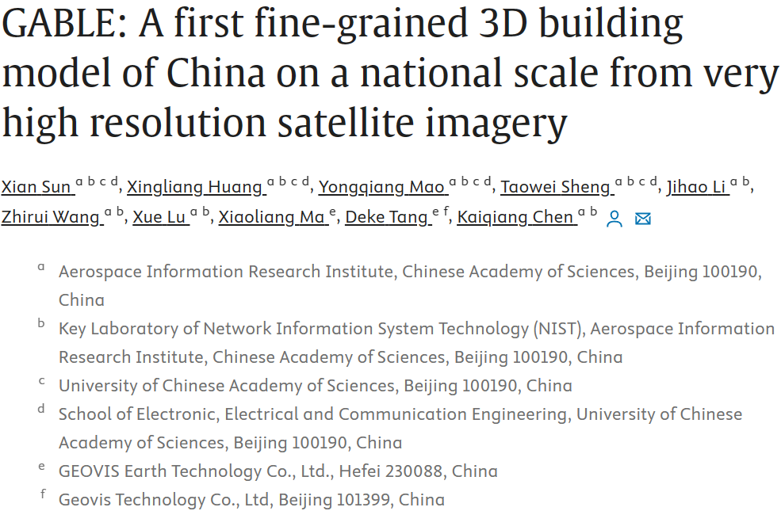

<div align="center"></div>

#
### NEWS !!!
* **`Jan. 03rd, 2024`:** :clap: Our paper is accepted by Remote Sensing of Environment! Refer to the **[Paper](https://www.sciencedirect.com/science/article/pii/S0034425724000683)** for more details.
* **`Jan. 03rd, 2024`:** :rocket: The shapefile data of three cities (Beijing, Tianjin, Shanghai) in GABLE have been made available. The data in other provinces is being sorted out. Enjoy it!
* **`Oct. 01st, 2023`:** :bulb: Our paper has been submitted Remote Sensing of Environment.

## <div align="center">Introduction</div>
Three-dimensional (3D) building models provide horizontal and vertical information of urban development patterns, which are significant to urbanization analysis, solar energy planning, carbon reduction and sustainability. Despite that many popular products on a global or national scale are proposed, these products usually focus on building extraction and height estimation at very coarse resolutions while building categories are not taken into consideration. In this study, we extend the previous work in two aspects involving the introduction of semantically fine-grained categories (i.e., 12 rooftop classes) and spatially fine-grained representations of individual buildings with compact polygons. Specifically, we develop a complete pipeline for the generation of the 3D building model, including developing a network for the joint rooftop extraction and classification, another parallel network for the height estimation, and a post-processing algorithm for the fusion of results from the two independent networks. To train the networks and improve the generalization, we construct two custom large-scale datasets in addition to the existing Urban Building Classification (UBC) datasets and 2023 IEEE Data Fusion Contest (DFC 2023). Finally, the nation-scale fine-GrAined 3D BuiLding modEl (GABLE) product is derived based on very high resolution (VHR) Beijing-3 satellite images with our proposed pipeline. GABLE provides a compact rooftop polygon, a category and a height value for each individual building instance. Further analyses are conducted to uncover the distribution of buildings on a national scale in terms of diversity, height and density, and reveal the relevance between buildings and socioeconomic parameters. These analyses demonstrate the significance and values of GALBE, while the potentials are far beyond these.

<div align="center"></div>

## Download


Beijing: [https://pan.baidu.com/s/11wZNvzd7bf8MdlC2Z7MTrg](https://pan.baidu.com/s/11wZNvzd7bf8MdlC2Z7MTrg) password: 1xvk

Tianjin: [https://pan.baidu.com/s/183PBHoc3gUiFUFvWMPGPbg](https://pan.baidu.com/s/183PBHoc3gUiFUFvWMPGPbg) password: tku7

Shanghai: [https://pan.baidu.com/s/1MWwDCjVzC8h7KjRxrAQKUQ](https://pan.baidu.com/s/1MWwDCjVzC8h7KjRxrAQKUQ) password: 809t

# Citation
If you find GABLE is useful in your research or applications, please consider giving us a star :star: and citing them by the following BibTeX entries:
```
@article{SUN2024114057,
title = {GABLE: A first fine-grained 3D building model of China on a national scale from very high resolution satellite imagery},
journal = {Remote Sensing of Environment},
volume = {305},
pages = {114057},
year = {2024},
issn = {0034-4257},
doi = {https://doi.org/10.1016/j.rse.2024.114057},
url = {https://www.sciencedirect.com/science/article/pii/S0034425724000683},
author = {Xian Sun and Xingliang Huang and Yongqiang Mao and Taowei Sheng and Jihao Li and Zhirui Wang and Xue Lu and Xiaoliang Ma and Deke Tang and Kaiqiang Chen}
}
```
